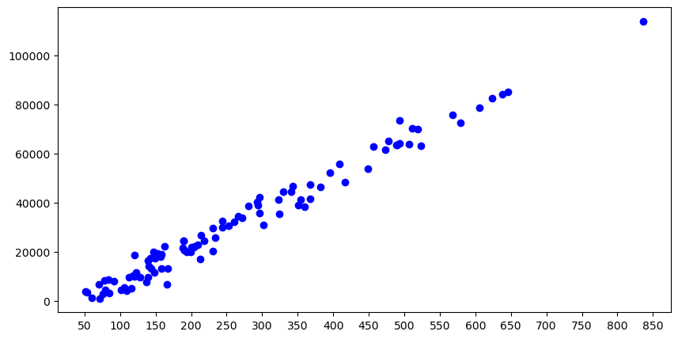
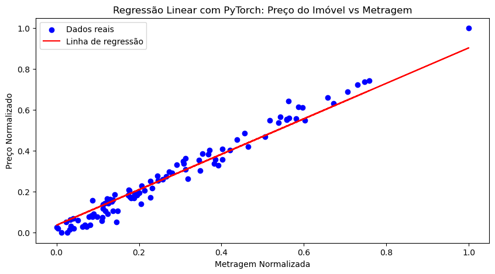
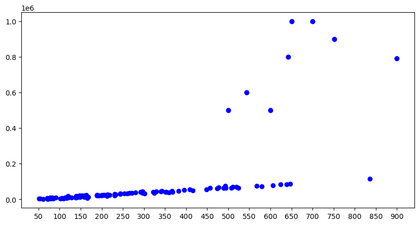
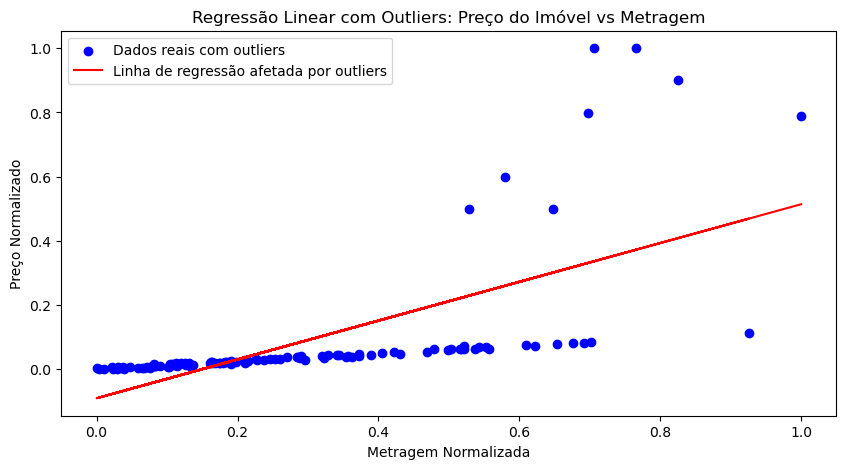
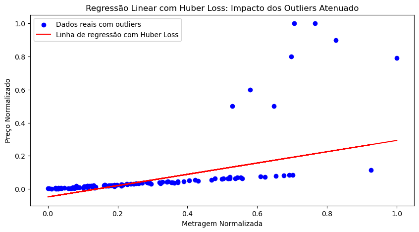
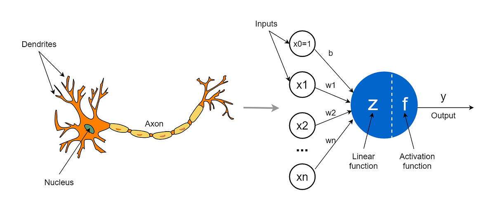
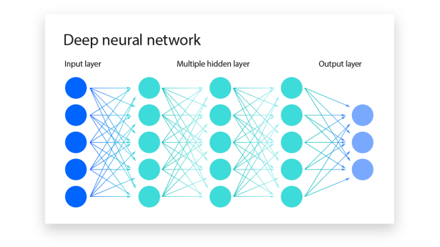
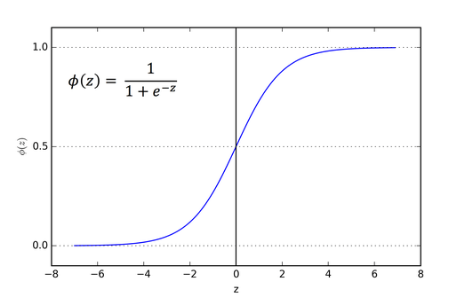
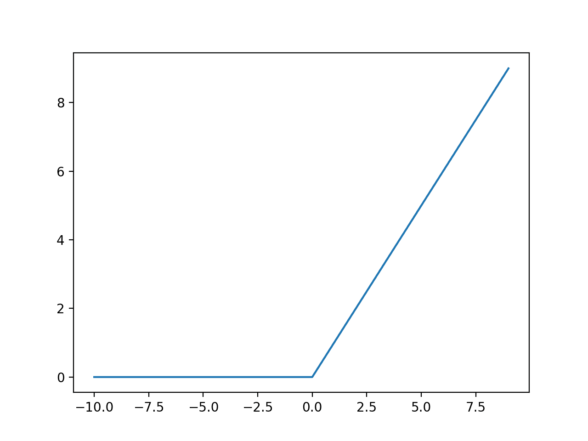
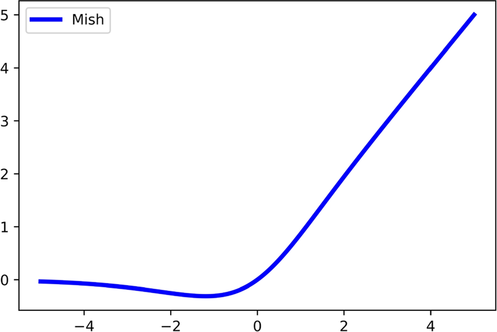

# Regressão, Redes Neurais, Huber Loss e Ativação Mish

## Introdução

A _Inteligência Artificial_ e o _Aprendizado de Máquina_ (ou _Machine Learning_, ML) explodiram em popularidade nos últimos anos, impulsionados principalmente pelo grande sucesso do modelo GPT-3, desenvolvido pela OpenAI. O GPT-3 tornou-se amplamente acessível através do ChatGPT (chat.openai.com), marcando um avanço significativo no campo dos Modelos de Linguagem de Grande Escala (LLMs ou "Large Language Models"), tornando tecnologias de IA avançadas amplamente acessíveis ao público geral. Essa nova tecnologia, extremamente útil e de fácil acesso, desencadeou uma corrida tecnológica entre as gigantes do setor, as "big techs", que passaram a competir para criar e disponibilizar seus LLMs, geralmente através de um modelo de assinatura mensal. Esse ambiente competitivo não só levou ao desenvolvimento do GPT-4, uma versão aprimorada do GPT-3, mas também ao surgimento de outros modelos como o Gemini do Google, o Claude da Anthropic, o Mistral da Mistral-AI e outros modelos não tão inteligentes assim, mas que conquistaram seus espaços com a comunidade open-source.

O que muitos não sabem é que o Aprendizado de Máquina é muito mais do que prever tokens (basicamente o que todo modelo de linguagem faz) e que os resultados incríveis que são alcançados hoje surgiram depois de muitas décadas de pesquisa em assuntos muito menos interessantes, mas ainda assim essenciais. O Aprendizado de Máquina clássico, baseado principalmente em métodos estatísticos criados há centenas de anos, e sua evolução, o Aprendizado Profundo, baseado no neurônio artificial que, de neurônio, só tem o nome, surgiram para resolver problemas menores e menos complicados, problemas esses que geralmente se encaixam em uma dessas duas categorias: **regressão** ou **classificação**.

A **regressão** se baseia em prever valores contínuos (números reais) através de variáveis que descrevem o problema, como prever o valor de uma casa através de suas especificações, como número de quartos, banheiros, metragem etc. Por outro lado, a **classificação** se baseia em prever valores discretos (números naturais), ou seja, prever a classe de um determinado objeto com base em suas variáveis, como prever se um email é _spam_ ou não, considerando que seu corpo contém frases como "ganhe dinheiro fácil minerando bitcoins" ou "para garantir seu prêmio de R\$ 20.000,00, faça um depósito de R\$ 5.000,00 para uma conta x".

O ponto desse texto é evidenciar que o Aprendizado de Máquina é muito mais do que acessar o ChatGPT e fazer prompts elaborados para obter respostas melhores e dar um gostinho de como "criar" modelos próprios usando o PyTorch e atiçar a sua curiosidade para buscar o conhecimento por si próprio.

## Python, PyTorch & etc

É amplamente conhecido que o Python é a ferramenta preferida dos cientistas de dados e engenheiros de machine learning. No entanto, o que muitos não sabem é que "criar" um modelo de machine learning não se baseia em escrever milhares de linhas de código. Na verdade, "criar" modelos de machine learning geralmente se resume a algumas linhas de código (dependendo do modelo e da ferramenta, cerca de 5). Isso porque alguém já foi lá e de fato escreveu as milhares de linhas necessárias; nós apenas as executamos com os nossos dados específicos. Essas implementações ficam guardadas em bibliotecas (ou "frameworks") para que todos que queiram criar seus próprios modelos possam usar em seu próprio código.

Existem diversas bibliotecas amplamente conhecidas e utilizadas em projetos de Aprendizado de Máquina, como o Scikit-Learn ([https://scikit-learn.org/stable/index.html](https://scikit-learn.org/stable/index.html)), utilizado principalmente para a criação de modelos "mais clássicos". Além disso, há bibliotecas mais avançadas e menos "user-friendly" como o PyTorch ([https://pytorch.org/](https://pytorch.org/)), o TensorFlow ([https://www.tensorflow.org/](https://www.tensorflow.org/)) e muitas outras pouco conhecidas, que focam em aplicações de Aprendizado Profundo.

O importante é entender que, independentemente da linguagem e da biblioteca que escolher para seu próximo projeto de Aprendizado de Máquina, você estará muito bem servido (dependendo de suas necessidades). Neste texto, irei explorar mais a fundo a biblioteca PyTorch e dois de seus módulos: a Huber Loss, uma função de perda utilizada para problemas de regressão, e a função de ativação Mish, que tem se provado uma excepcional opção em diversas arquiteturas de redes neurais modernas.

## Regressão Linear e Suas funções de custo

Quando falamos em **regressão**, falamos em prever o valor de uma variável contínua com base nos valores de uma série de outras variáveis. Existem dezenas de algoritmos de regressão diferentes, desde os mais simples como a **Regressão Linear** que, obviamente, funciona apenas quando a relação entre a variável dependente (aquela que queremos prever) e as variáveis independentes (aquelas que usamos para prever) é linear, até alguns mais complexos, como **Regressão Polinomial**, usados em casos onde temos comportamentos não lineares. Independentemente do caso, em regressão, queremos prever uma linha (ou hiperplano, em casos de alta dimensionalidade), mesmo que ela nem sempre seja reta.

Na **Regressão Linear Simples**, queremos prever uma linha reta que apresente o "melhor ajuste" para um determinado conjunto de pontos. Em outras palavras, queremos saber qual reta que passa o mais perto possível de todos os pontos ao mesmo tempo. Para entender melhor, considere o seguinte exemplo:

- A variável **X** representa a metragem de uma determinada casa.
- A variável **Y** representa o valor (em reais) dessa casa.

Nosso objetivo é prever, com base na sua metragem, o valor em reais da casa. Para isso, damos uma espiada no gráfico abaixo.

Como podemos ver pelo gráfico acima, existe uma grande correlação entre a metragem da casa e seu valor. Ao aplicar um algoritmo de regressão linear nesses dados, estamos basicamente desenhando uma linha reta que explica como valor da casa se comporta com base na sua metragem. Para esse problema (e qualquer outro de regressão) existem infinitas retas que podem ser encaixadas nesse gráfico. Após treinar um modelo de regressão básico, essa é a reta que consegui:

Se você acha que essa reta vermelha é a melhor para essa problema, você está correto. Mas porquê?

A reta vermelha é a reta que minimiza o **erro quadrático médio (MSE)** entre a reta e os pontos. Mais especificamente, pense da seguinte forma. Para cada ponto (valor da casa e sua metragem), calculamos sua distância para a reta (isso gera um valor _x_, o erro) e elevamos esse valor ao quadrado. Depois de fazer isso para todos os pontos, tiramos a média.  Com isso, sabemos o quâo bom nosso modelo se ajustou aos dados (quanto menor o erro, melhor). O **MSE** é calculado da seguinte forma:

$$MSE = \frac{1}{n}\sum_{i=1}^n(Y_i-\hat{Y_i})^2$$Onde:

- $Y_i$ é o valor da casa
- $\hat{Y_i}$ é o valor previsto da casa

Usando essa **função de custo**, a melhor linha (ou o melhor modelo) é aquele que à minimiza.

Outra função de custo muito utilizada em problemas de regressão é o **erro médio absoluto (MAE)**, que funciona de forma muito parecida:
$$MAE = \frac{1}{n}\sum_{i=1}^n|Y_i-\hat{Y_i}|$$
Sim, essa função é igual ao MSE, mas ao invés de elevarmos o error da previsão ao quadrado, pegamos o seu módulo.

## Os temidos outliers

Nem tudo são flores, o $MSE$ não é perfeito e eu posso provar. Olhe o gráfico abaixo, novamente sobre o valor de casas sobre suas metragens:

Percebeu algo diferente? Sim. Nesse gráfico, temos algumas casas que não seguem exatamente o comportamento "padrão". Algumas casas tem metragens muito pequenas para o preço a que estão sendo vendidas. Provavelmente alguma outra variável, como a localização do imóvel, ajudaria e explicar essa discrepância, mas isso não vem ao caso. O que importa é que nossos dados possuem um outliers e isso é um problema. Outliers são pontos que diferem significativamente de outros pontos do conjunto de dados e isso vai atrapalhar e muito nosso modelo.

Quando calculamos, para esses dados, a reta que minimiza o $MSE$, obtemos o seguinte resultado:

Isso é péssimo. Os outliers "puxaram" a reta para mais perto deles, embora todos os outros pontos estejam seguindo um comportamento muito diferente. Porque isso acontece?

Simplesmente devido ao próprio funcionamento do $MSE$. Essa função de custo **penaliza** grandes erros, pois ela aumenta de forma quadrática à medida que o erro aumenta. Dessa forma, pequenos erros geram pequenos aumentos no custo e pequenas alterações na reta, enquanto grandes erros geram aumentos colossais no custo e grandes alterações na reta. Mas não se preocupe, existe uma outra função de custo que vai mitigar o problema causado por outliers, a Huber Loss.

## Huber Loss

A Huber Loss é uma função de custo utilizada na **Regressão Robusta**, que é menos sensível a outliers do que o **erro médio quadrático**. Ela é definida da seguinte forma:

$$
L_\delta =
\begin{cases}
\frac{1}{2}(y-\hat{y})^2, &\text{if } |y-\hat{y}|\leq\delta \\
\delta \cdot (|y - \hat{y}|-\frac{1}{2}\delta), &\text{otherwise}
 \end{cases}
$$

Basicamente, é uma função de custo parametrizada por um parâmetro $\delta$, que a faz funcionar de maneira quadrática, para erros pequenos e linear para erros grandes. Essa propriedade faz com que o resíduo gerado por outliers não impacte de forma tão marcante o erro, impedindo com que a reta seja "puxada" em direção a esses pontos, como foi visto no exemplo anterior.

Também conhecida como **Smooth L1 Loss**, A Huber Loss é uma combinação das funções de erro quadrático médio (MSE) e erro médio absoluto (MAE). A ideia por trás dessa função de custo é aproveitar o melhor dos dois mundos: a sensibilidade do MSE a pequenos erros e a robustez do MAE a grandes erros.

### Como a Huber Loss Funciona

O parâmetro $\delta$ é o que determina o limite entre o comportamento quadrático e linear da função de custo. Para erros menores que $\delta$, a função se comporta de maneira quadrática, penalizando mais fortemente os erros pequenos, como o MSE. Isso é útil para ajustar o modelo de forma precisa aos dados. Para erros maiores que $\delta$, a função se comporta de maneira linear, como o MAE, reduzindo a influência de outliers no ajuste do modelo.

### Escolhendo o Valor de $\delta$

A escolha do valor de $\delta$ é muito importante para o bom desempenho de um modelo treinado com a Huber Loss. Um valor muito baixo pode fazer com que a função se comporte de maneira muito parecido com o MAE, perdendo sensibilidade a pequenos erros. Por outro lado, um valor muito alto pode fazer com que a função se comporte de maneira muito parecida com o MSE, levando a problemas com outliers. Na prática, o valor de $\delta$ é escolhido através de validação cruzada ou experimentação.

### Vantagens da Huber Loss

- **Robustez a Outliers:** Ao penalizar menos os erros grandes, a Huber Loss é mais robusta a outliers do que o MSE.
- **Sensibilidade a Pequenos Erros:** Ao penalizar mais fortemente os erros pequenos, a Huber Loss mantém a sensibilidade do MSE a pequenos desvios nos dados.

### Desvantagens da Huber Loss

- **Escolha do Parâmetro $\delta$:** A necessidade de escolher um valor para o parâmetro $\delta$ adiciona uma camada de complexidade à otimização do modelo.
- **Menos Eficiente para Grandes Conjuntos de Dados:** Devido à sua natureza condicional, a Huber Loss pode ser menos eficiente computacionalmente do que o MSE ou o MAE para conjuntos de dados muito grandes.

### Aplicação da Huber Loss em PyTorch

No PyTorch, a Huber Loss pode ser implementada usando a classe `torch.nn.HuberLoss`. Aqui está um exemplo de como usá-la:

    import torch 
    import torch.nn as nn 
    
    # Definindo os dados 
    y_true = torch.tensor([3.0, 5.0, 2.5, 7.0]) 
    y_pred = torch.tensor([2.5, 5.2, 2.0, 6.8])
     
    # Instanciando a Huber Loss com delta = 1
    huber_loss = nn.HuberLoss(delta=1.0) 
    
    # Calculando a loss
    loss = huber_loss(y_pred, y_true) 
    print(f'Huber Loss: {loss.item()}')

A class nn.HuberLoss possuir dois parâmetros:

1. **`reduction`**: Especifica a forma de redução a ser aplicada aos outputs. Pode ter os seguintes valores
    - `'none'`: Não aplica redução. Retorna a perda por elemento do batch.
    - `'mean'`: Calcula a média das perdas de todos os elementos do batch. Este é o valor padrão.
    - `'sum'`: Soma as perdas de todos os elementos do batch.

    A escolha do modo de redução afeta como as perdas são agregadas (ou não) ao longo do batch. Por exemplo, se você tem um batch com 10 elementos e o modo de redução é `'mean'`, a perda total será a média das perdas de todos os 10 elementos.

2. **`delta`**: Define o ponto de transição entre a perda L1 e L2. Para erros menores que `delta`, a perda é quadrática, e para erros maiores, a perda é linear. O valor padrão é 1.0. Este parâmetro controla a sensibilidade da perda de Huber a outliers. Com um valor maior de `delta`, mais erros serão tratados de forma quadrática, tornando a perda mais resistente a outliers.

## Na Prática

Deixe-me mostrar como a _Huber Loss_ pode melhorar a performance de um modelo de regressão. Vamos usar o mesmo dataset visto anteriormente: O valor das casas com base em sua metragem (incluindo os outliers). Veja o gráfico:

Vamos primeiro treinar um algoritmo de regressão linear com utilizando o MSE e observar a linha resultante:

    # Instanciar o modelo
    model = LinearRegressionModel()

    # Loss e otimizador
    criterion = nn.MSELoss()
    optimizer = optim.SGD(model.parameters(), lr=0.01)

    # Treinar o modelo
    epochs = 1000
    for epoch in range(epochs):
        model.train()
        optimizer.zero_grad()
        outputs = model(X)
        loss = criterion(outputs, Y)
        loss.backward()
        optimizer.step()

        if epoch % 100 == 0:
            print(f'Epoch [{epoch+1}/{epochs}], Loss: {loss.item():.4f}')

    predicted = model(X).detach().numpy()
    plt.figure(figsize=(10, 5))
    plt.scatter(X_scaled, Y_scaled, color='blue', label='Dados reais com outliers')
    plt.plot(X_scaled, predicted, color='red', label='Linha de regressão afetada por outliers')
    plt.xlabel('Metragem Normalizada')
    plt.ylabel('Preço Normalizado')
    plt.title('Regressão Linear com Outliers: Preço do Imóvel vs Metragem')
    plt.legend()
    plt.show()

A linha resultante:

Agora vamos treinar exatamente o mesmo modelo, com a Huber Loss no lugar:

    # Instanciar o modelo
    model = LinearRegressionModel()

    # Loss e otimizador usando Huber Loss
    criterion = nn.HuberLoss(delta=0.1)  # O delta pode ser ajustado conforme a necessidade
    optimizer = optim.SGD(model.parameters(), lr=0.01)

    # Treinar o modelo
    epochs = 1000
    for epoch in range(epochs):
        model.train()
        optimizer.zero_grad()
        outputs = model(X)
        loss = criterion(outputs, Y)
        loss.backward()
        optimizer.step()

        if epoch % 100 == 0:
            print(f'Epoch [{epoch+1}/{epochs}], Loss: {loss.item():.4f}')

    # Plotar os dados e a linha de regressão
    predicted = model(X).detach().numpy()
    plt.figure(figsize=(10, 5))
    plt.scatter(X_scaled, Y_scaled, color='blue', label='Dados reais com outliers')
    plt.plot(X_scaled, predicted, color='red', label='Linha de regressão com Huber Loss')
    plt.xlabel('Metragem Normalizada')
    plt.ylabel('Preço Normalizado')
    plt.title('Regressão Linear com Huber Loss: Impacto dos Outliers Atenuado')
    plt.legend()
    plt.show()

A linha resultante:

Como pode ver, a Huber Loss mitiga os problemas causados pelos outliers e e ajuda bastante na estimação de um modelo ideal.

## Redes Neurais, Neurônios e Ativações

As redes neurais são uma das ferramentas mais poderosas e  utilizadas em aprendizado de máquina e inteligência artificial. Elas são inspiradas no funcionamento do cérebro humano e consistem em uma rede de unidades de processamento chamadas neurônios. Essas redes são capazes de aprender padrões complexos e realizar tarefas como reconhecimento de imagem, processamento de linguagem natural, previsão de séries temporais, geração de conteúdo (como o GPT) e muito mais. Mas o quê são os neurônios?

### O que é um Neurônio?

Um neurônio é a unidade básica de uma rede neural. Ele recebe entradas de outros neurônios ou de fontes externas, processa essas entradas e gera uma saída. A saída de um neurônio é determinada pela combinação das entradas ponderadas e uma função de ativação. Cada entrada é multiplicada por um peso, que representa a importância relativa dessa entrada para o neurônio. Esses pesos são ajustados durante o treinamento da rede neural para otimizar o desempenho da rede.

### Como Funcionam as Redes Neurais?

As redes neurais são formadas pela conexão de vários neurônios em camadas. Existem geralmente três tipos de camadas em uma rede neural: a camada de entrada, as camadas ocultas e a camada de saída. A camada de entrada recebe os dados de entrada, as camadas ocultas processam esses dados através de uma série de transformações, e a camada de saída gera a saída final da rede. O fluxo de informações e o ajuste dos pesos durante o treinamento permitem que a rede neural aprenda a mapear as entradas para as saídas desejadas.

As redes neurais são capazes de aprender e modelar relações não-lineares complexas, tornando elas a escolha  perfeita para uma grande quantidade de tarefas de aprendizado de máquina. Elas são ainda mais úteis em datasets onde os padrões são difíceis de serem explicitamente programados ou definidos por regras simples.

## Funções de Ativação: O quê são e para que servem?

Em redes neurais, as funções de ativação são fundamentais para introduzir não-linearidade nos modelos. Elas são aplicadas à saída de cada neurônio e determinam se ele deve ser ativado ou não, ou seja, se a informação que ele processa deve ser passada adiante na rede. Sem funções de ativação, uma rede neural seria equivalente a uma regressão linear gigante, sem poder aprender padrões complexos nos dados. As funções de ativação são importantes para a aprendizagem e o desempenho das redes neurais. Elas permitem que as redes capturem relações não-lineares entre os dados de entrada e as saídas desejadas.

As funções de ativação desempenham um papel vital em redes neurais por várias razões:

- **Introdução de Não-linearidade:** As funções de ativação permitem que as redes neurais aprendam padrões complexos e não-lineares nos dados.
- **Controle do Fluxo de Informações:** Elas determinam quais informações são importantes e devem ser passadas adiante na rede.

### Função de Ativação Sigmoid

A função de ativação sigmoide é uma das funções de ativação mais antigas e amplamente utilizadas. É definida pela seguinte equação:

$$ \sigma(x) = \frac{1}{1 + e^{-x}} $$

A função sigmoide mapeia qualquer valor de entrada para um intervalo entre 0 e 1, tornando-a útil para problemas de classificação binária, onde a saída pode ser interpretada como uma probabilidade.

No entanto, a função sigmoide enfrenta o desafio do gradiente desaparecendo para entradas extremamente altas ou baixas, o que pode atrasar o processo de treinamento da rede. Isso acontece porque a derivada dessa função (se você não estiver familiarizado, pense na derivada como **"a variação no valor da função se eu ajustar um pouco o valor de entrada"**). Observando o gráfico, quando a entrada da sigmoide é muito alta ou muito baixa, o valor da função em si (nas extremidades esquerda e direita da função) quase não muda, ou seja, o gradiente é praticamente zero.

### Função de Ativação ReLU

A função de ativação ReLU (Rectified Linear Unit) é atualmente uma das funções de ativação mais populares em redes neurais profundas. É definida como:
$$ \text{ReLU}(x) = \max(0, x) $$
A função ReLU mantém valores positivos iguais a como eles entram, enquanto zera valores negativos. Isso proporciona uma saída esparsa e acelera o treinamento da rede, ao mesmo tempo em que reduz a probabilidade do desaparecimento do gradiente.

A simplicidade e eficiência da ReLU a tornaram a escolha padrão para muitas arquiteturas de rede neural.

## Função de Ativação Mish

A função de ativação Mish é uma das funções de ativação mais recentes e tem ganhado popularidade devido ao seu desempenho em várias tarefas de aprendizado profundo. A função Mish é definida como:
$$ \text{Mish}(x) = x \cdot \tanh(\text{softplus}(x)) = x \cdot \tanh(\ln(1 + e^x)) $$

### Características da Função Mish

- **Não-linearidade:** Assim como outras funções de ativação, a Mish introduz não-linearidade no modelo, o que é crucial para aprender padrões complexos.
- **Suavidade:** A função Mish é suave e contínua, o que ajuda no processo de otimização, especialmente em redes neurais profundas.
- **Não-saturação:** Diferentemente da função sigmóide ou tanh, a Mish não satura positivamente, o que significa que não há limitação superior para a saída. Isso ajuda a evitar o problema do desaparecimento do gradiente, que é comum em redes profundas.

### Vantagens da Função Mish  

- **Melhor Desempenho:** Em várias tarefas e benchmarks de aprendizado profundo, a função Mish demonstrou superar outras funções de ativação populares, como ReLU e Leaky ReLU.
- **Prevenção do Desaparecimento do Gradiente:** Devido à sua não-saturação positiva, a Mish ajuda a mitigar o problema do desaparecimento do gradiente, permitindo o treinamento eficaz de redes neurais mais profundas.

Em um gráfico, a função Mish seria algo assim:

### Desvantagens da Função Mish

- **Complexidade Computacional:** A função Mish é mais complexa do que funções de ativação como ReLU, o que pode levar a um aumento no tempo de treinamento e nos recursos computacionais necessários.
- **Instabilidade Numérica:** Para valores muito altos de entrada, a função Mish pode sofrer de instabilidade numérica devido à exponenciação na função softplus.

### Aplicação da Função Mish em PyTorch

    # Criar um tensor de entrada com valores de -10 a 10
    x = torch.linspace(-10, 10, 10)

    # Definir as funções de ativação
    relu = nn.ReLU()
    sigmoid = nn.Sigmoid()
    mish = nn.Mish()

    # Aplicar as funções de ativação
    y_relu = relu(x)
    y_sigmoid = sigmoid(x)
    y_mish = mish(x)

    # Imprimir os resultados das funções de ativação
    print("ReLU Output:")
    print(y_relu)
    print("\nSigmoid Output:")
    print(y_sigmoid)
    print("\nMish Output:")
    print(y_mish)

Resultados:

    ReLU Output:
    tensor([ 0.0000,  0.0000,  0.0000,  0.0000,  0.0000,  1.1111,  3.3333,  5.5556,
            7.7778, 10.0000])

    Sigmoid Output:
    tensor([4.5398e-05, 4.1877e-04, 3.8510e-03, 3.4445e-02, 2.4766e-01, 7.5234e-01,
            9.6555e-01, 9.9615e-01, 9.9958e-01, 9.9995e-01])

    Mish Output:
    tensor([-4.5399e-04, -3.2578e-03, -2.1436e-02, -1.1679e-01, -3.0792e-01,
            9.8268e-01,  3.3254e+00,  5.5554e+00,  7.7778e+00,  1.0000e+01])

## Referências

- [1] Diganta Misra. "Mish: A Self Regularized Non-Monotonic Activation Function". arXiv:1908.08681 [cs.LG]. Disponível em: [https://arxiv.org/abs/1908.08681](https://arxiv.org/abs/1908.08681)

- [2] "PyTorch HuberLoss Documentation". Disponível em: [https://pytorch.org/docs/stable/generated/torch.nn.HuberLoss.html](https://pytorch.org/docs/stable/generated/torch.nn.HuberLoss.html)

- [3] "Huber Loss - Wikipedia". Disponível em: [https://en.wikipedia.org/wiki/Huber_loss](https://en.wikipedia.org/wiki/Huber_loss)

- [4] "Mish Activation Function - Papers with Code". Disponível em: [https://paperswithcode.com/method/mish](https://paperswithcode.com/method/mish#:~:text=Mish%20is%20an%20activation%20function,x%20%CF%83%20(%20x%20)%20.)

- [5] "PyTorch Mish Documentation". Disponível em: [https://pytorch.org/docs/stable/generated/torch.nn.Mish.html](https://pytorch.org/docs/stable/generated/torch.nn.Mish.html)

- [6] "# Robust Regression with Huber Loss - Clearly Explained". YouTube. Disponível em: [https://www.youtube.com/watch?v=zSjoxH6fVHE](https://www.youtube.com/watch?v=zSjoxH6fVHE)

Texto escrito por Thiago de Almeida Macedo como parte do trabalho da cadeira "Aprendizado Profundo 2"
